# Argument Resolver - System Architecture

> An AI-powered system for recording, analyzing, and fact-checking conversations in real-time using Raspberry Pi and AWS.

## System Overview

```mermaid
graph TB
    subgraph "Raspberry Pi"
        MIC[🎤 USB Microphone]
        REC[Audio Recorder]
        DIAR[Speaker Diarization<br/>pyannote.audio]
        TRANS[Speech-to-Text<br/>Whisper]
        MIC --> REC
        REC --> DIAR
        DIAR --> TRANS
    end

    subgraph "AWS EC2 - Processing Server"
        RECV[📥 Results Receiver<br/>FastAPI :7864]
        EMOTION[🎭 Emotion Classifier<br/>SentenceTransformers + PyTorch]
        FACT[🔍 Segment Fact Checker<br/>Multi-Source Orchestrator]
        STORAGE[(💾 Arguments Database<br/>JSON Files)]

        RECV --> EMOTION
        RECV --> FACT
        EMOTION --> STORAGE
        FACT --> STORAGE
    end

    subgraph "Fact-Checking Sources"
        KB[📚 Knowledge Base<br/>RAG + Semantic Search<br/>25 curated facts]
        POLY[📊 Polymarket API<br/>Prediction Markets<br/>Gamma API]
        WEB[🌐 Web Search<br/>DuckDuckGo HTML]

        FACT --> KB
        FACT --> POLY
        FACT --> WEB
    end

    subgraph "Web Interface"
        BROWSE[💬 Browse Arguments<br/>Gradio UI :7863]
        UI[Interactive Chat Bubbles<br/>Hover Panels<br/>Citations & Sources]

        BROWSE --> UI
    end

    TRANS -.HTTP POST.-> RECV
    STORAGE -.Read.-> BROWSE

    style MIC fill:#ff9999
    style RECV fill:#99ccff
    style EMOTION fill:#ffcc99
    style FACT fill:#cc99ff
    style KB fill:#99ff99
    style POLY fill:#ffff99
    style WEB fill:#99ffcc
    style BROWSE fill:#ff99ff
    style STORAGE fill:#cccccc
```



## Data Flow Sequence


## Component Details

### Emotion Classification Pipeline


**Supported Emotions:**
- 😌 Calm
- 💪 Confident
- 🛡️ Defensive
- 🙄 Dismissive
- 🔥 Passionate
- 😤 Frustrated
- 😠 Angry
- 😏 Sarcastic

### Fact-Checking Pipeline

```mermaid
graph LR
    subgraph "Multi-Source Fact-Checking"
        QUERY[Segment Text]

        QUERY --> RAG[RAG Search<br/>Cosine Similarity<br/>Threshold: 0.3]
        QUERY --> API[Polymarket API<br/>/markets endpoint]
        QUERY --> SEARCH[DuckDuckGo<br/>HTML Parser]

        RAG --> MERGE[Merge Results<br/>Supporting ✅<br/>Contradicting ❌]
        API --> MERGE
        SEARCH --> MERGE

        MERGE --> OUTPUT[Facts with<br/>Citations & URLs]
    end
```



**Fact Sources:**
1. **Knowledge Base** (📚): 25 curated facts across 10+ categories with semantic search
2. **Polymarket** (📊): Real-time prediction market data for current events
3. **Web Search** (🌐): DuckDuckGo results for general fact verification

## Technology Stack

| Component | Technologies |
|-----------|-------------|
| **Raspberry Pi** | Python, pyannote.audio, OpenAI Whisper, requests |
| **AWS Processing** | FastAPI, uvicorn, SentenceTransformers, PyTorch, asyncio |
| **Knowledge Base** | JSON storage, cosine similarity, semantic embeddings |
| **Fact-Checking** | DuckDuckGo HTML API, Polymarket Gamma API, BeautifulSoup4 |
| **Web UI** | Gradio, HTML/CSS hover interactions, JavaScript |
| **Storage** | JSON file-based database |

## File Structure

```
aiot_project/
├── pi_record_and_process.py      # Raspberry Pi recording & processing
├── results_receiver.py            # AWS receiver with emotion + fact-checking
├── browse_arguments.py            # Interactive chat UI
├── emotion_classifier.py          # Emotion analysis model
├── segment_fact_checker.py        # Multi-source fact-checking orchestrator
├── knowledge_base.py              # RAG semantic search system
├── polymarket_client.py           # Polymarket API client
├── knowledge_base.json            # 25 curated facts database
├── storage.py                     # Database manager
└── arguments_db/                  # Stored conversations
    ├── arguments.json             # Index of all arguments
    └── arguments/
        └── {timestamp}/
            ├── audio.wav          # Original recording
            ├── transcript.txt     # Full transcript
            └── metadata.json      # Segments + emotions + facts
```

## API Endpoints

### AWS EC2 Server

#### Results Receiver (Port 7864)
- `POST /receive_results` - Receive processed arguments from Pi
- `GET /` - Server status and statistics
- `GET /arguments` - List all stored arguments

#### Browse Arguments (Port 7863)
- `GET /` - Interactive chat UI for browsing arguments
- Search and filter functionality
- Real-time hover-based analysis panels

## Key Features

### 1. **Distributed Architecture**
- **Edge device** (Pi): Lightweight capture and preprocessing
- **Cloud processing** (AWS): Heavy ML inference
- **Client** (Browser): Interactive visualization

### 2. **Real-time Processing**
- 30-second conversation chunks
- Automatic speaker diarization
- Parallel emotion analysis and fact-checking

### 3. **Multi-Source Fact-Checking**
- Never returns "no data found"
- Combines local knowledge, prediction markets, and web search
- Explicit messaging when no factual claims detected

### 4. **Interactive UI**
- Chat bubble interface with visual gradients
- Hover-based analysis panels
- Clickable source citations
- Chronological segment ordering

## Performance Characteristics

- **Recording latency**: ~30 seconds per chunk
- **Processing time**: ~10-15 seconds (diarization + transcription)
- **Emotion analysis**: ~100ms per segment
- **Fact-checking**: ~2-3 seconds per segment (parallel queries)
- **Total end-to-end**: ~45-50 seconds from recording to visualization

## Security & Privacy

- Local audio processing on Raspberry Pi
- Encrypted transmission to AWS (HTTPS)
- Private EC2 instance (no public data storage)
- File-based database (no external services)
- Optional API key management for external services

## Future Enhancements

- [ ] Real-time streaming instead of 30s chunks
- [ ] Multi-language support
- [ ] Advanced emotion models (fine-tuned on argument data)
- [ ] Larger knowledge base with automatic updates
- [ ] User feedback loop for fact accuracy
- [ ] Mobile app integration
- [ ] Export to PDF/presentations

---

**License**: MIT

**Author**: Ifesi
