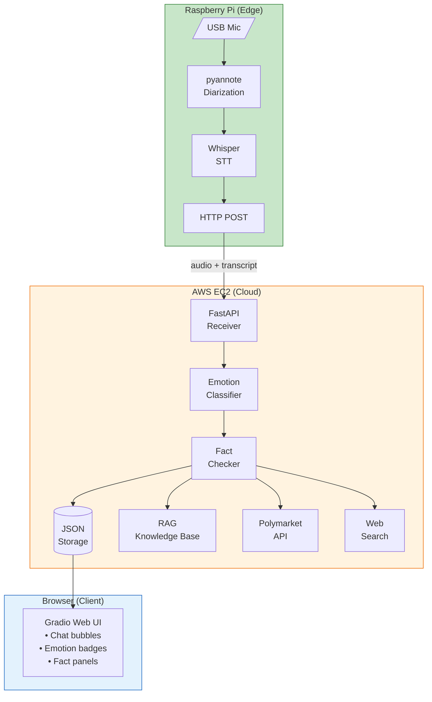
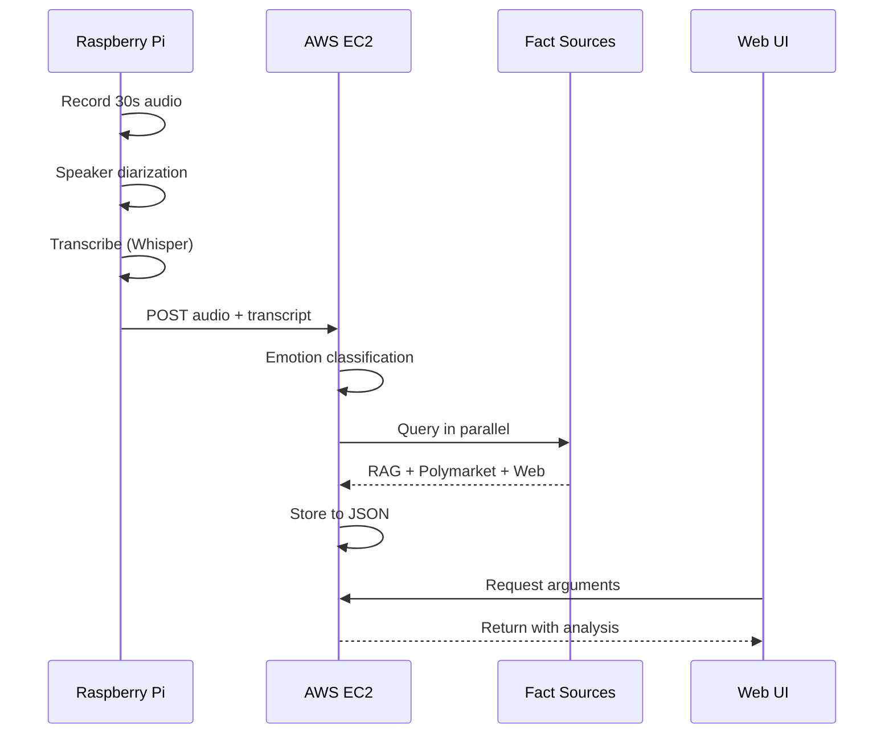

# Argument Resolver with Polymarket Integration

A distributed AI-powered system for real-time conversation analysis, emotion detection, and multi-source fact-checking using prediction markets, semantic search, and web data.

## Overview

This system records conversations, identifies speakers, transcribes speech, analyzes emotional dynamics, and fact-checks claims against multiple sources including Polymarket prediction markets.

### Key Features

- **Real-time Speech Processing**: 30-second audio capture with speaker diarization
- **8-Class Emotion Detection**: Calm, Confident, Defensive, Dismissive, Passionate, Frustrated, Angry, Sarcastic
- **Multi-Source Fact-Checking**:
  - RAG-based semantic search over curated knowledge base
  - Polymarket prediction market integration with LRU caching
  - DuckDuckGo web search fallback
- **Interactive Web UI**: Gradio-based chat interface with emotion badges and fact citations

## Live Demo

**Try it now:** [http://54.209.249.85:7863/](http://54.209.249.85:7863/)

> **Note:** Most recorded conversations have been deleted to reduce AWS storage costs. A sample conversation from our class demo is preserved and viewable at argument ID: `20251205_151855`

## System Architecture



### Data Flow



## Project Structure

```
arg_resolv_polymarket/
├── pi_record_and_process.py    # Raspberry Pi: record, diarize, transcribe
├── results_receiver.py         # AWS: FastAPI server receiving results
├── emotion_classifier.py       # Emotion analysis (8 classes)
├── segment_fact_checker.py     # Multi-source fact-checking orchestrator
├── knowledge_base.py           # RAG semantic search system
├── knowledge_base.json         # Curated facts database
├── polymarket_client.py        # Polymarket API client with LRU cache
├── browse_arguments.py         # Gradio web UI
├── storage.py                  # JSON database manager
├── argument_processing.py      # Shared processing utilities
├── models/
│   └── enhanced_argument_classifier.pt  # Trained emotion model
├── arguments_db/               # Stored arguments database
├── docs/
│   ├── DEPLOYMENT_PI.md        # Raspberry Pi setup guide
│   ├── DEPLOYMENT_AWS.md       # AWS EC2 setup guide
│   └── ARCHITECTURE.md         # Detailed system architecture
└── requirements.txt            # Python dependencies
```

## Quick Start

### Prerequisites

- Raspberry Pi 4 (4GB+) with USB microphone
- AWS EC2 instance (t2.large or better)
- Python 3.9+
- HuggingFace token (for pyannote)

### Installation

1. **Clone the repository**
```bash
git clone https://github.com/ifesiTinkering/arg_resolv_polymarket.git
cd arg_resolv_polymarket
```

2. **Install dependencies**
```bash
pip install -r requirements.txt
```

3. **Set up environment variables**
```bash
cp .env.example .env
# Edit .env with your API keys
```

4. **Download the emotion model**
```bash
# Model should be in models/enhanced_argument_classifier.pt
```

### Running the System

**On AWS EC2 (Server):**
```bash
# Start the results receiver
python results_receiver.py

# In another terminal, start the web UI
python browse_arguments.py
```

**On Raspberry Pi (Edge):**
```bash
# Set the server IP
export LAPTOP_IP=<your-ec2-public-ip>

# Start recording
python pi_record_and_process.py
```

**Access the Web UI:**
```
http://<ec2-ip>:7863
```

## Documentation

- [Raspberry Pi Deployment Guide](docs/DEPLOYMENT_PI.md)
- [AWS EC2 Deployment Guide](docs/DEPLOYMENT_AWS.md)
- [System Architecture](docs/ARCHITECTURE.md)

## Components

### Emotion Classifier

8-class emotion detection using a linear probe over frozen SentenceTransformer embeddings:

| Emotion | Description | F1-Score |
|---------|-------------|----------|
| Angry | Heated, hostile | 82% |
| Confident | Assertive, certain | 79% |
| Calm | Measured, rational | 76% |
| Passionate | Enthusiastic | 74% |
| Frustrated | Annoyed, impatient | 71% |
| Dismissive | Condescending | 70% |
| Defensive | Protective, justifying | 68% |
| Sarcastic | Mocking, ironic | 65% |

**Overall Accuracy: 73.2%**

### RAG Knowledge Base

Semantic search over 25+ curated facts using cosine similarity:

- **Model**: all-MiniLM-L6-v2 (384-dim embeddings)
- **Threshold**: 0.3 minimum similarity
- **Categories**: Climate, AI, Remote Work, Transportation, Energy, etc.

### Polymarket Integration

Real-time prediction market data with intelligent caching:

- **Preloaded**: 22 markets across sports, politics, tech
- **Cache Size**: 30 markets (LRU eviction)
- **Fallback**: API query for new topics

## Performance

| Component | Metric | Value |
|-----------|--------|-------|
| Pi Diarization | Processing Time | 2-3 sec |
| Pi Transcription | Processing Time | 2-3 sec |
| Emotion Classifier | Inference Time | ~100 ms |
| RAG Search | Query Time | ~50 ms |
| Polymarket Lookup | Query Time | ~80 ms |
| Web Search | Query Time | 1-2 sec |
| **End-to-End** | **Total Latency** | **6-10 sec** |

## API Endpoints

### Results Receiver (port 7864)

```
POST /receive_results
  - audio: WAV file
  - transcript: Text file
  - metadata: JSON file

GET /health
  - Returns server status
```

### Browse UI (port 7863)

Gradio web interface for viewing stored arguments.

## Environment Variables

```bash
# Required
HUGGINGFACE_TOKEN=hf_xxxxx      # For pyannote speaker diarization
LAPTOP_IP=x.x.x.x               # Server IP (for Pi)

# Optional
POE_API_KEY=xxxxx               # For training data generation
```

## Training the Emotion Classifier

```bash
cd whisper_finetune

# Generate training data (requires POE_API_KEY)
python train_text_emotion_classifier.py generate 500

# Train the model
python train_text_emotion_classifier.py train
```

## Testing & Evaluation

### Test Data Location

```
whisper_finetune/
├── test_data/
│   └── test_set.json              # 299 labeled test samples
├── training_data/
│   ├── enhanced_labeled_arguments.json  # 500 training samples
│   └── test_examples.json         # Example predictions per class
├── TEST_RESULTS.md                # Detailed evaluation report
├── TESTING_GUIDE.md               # How to run tests
└── comprehensive_evaluation.py    # Evaluation script
```

### Test Set Structure

Each test sample in `test_set.json`:
```json
{
  "id": "test_calm_001",
  "text": "Let's examine the data objectively...",
  "topic": "remote work",
  "true_emotion": "calm",
  "true_emotion_idx": 0,
  "true_uncertainty": 0.0,
  "true_confidence": 0.0
}
```

### Running Evaluation

```bash
cd whisper_finetune

# Run comprehensive evaluation
python comprehensive_evaluation.py

# Quick test with sample inputs
python test_classifier.py
```

### Evaluation Metrics

| Metric | Description |
|--------|-------------|
| **Accuracy** | Overall correct predictions |
| **Precision** | True positives / Predicted positives |
| **Recall** | True positives / Actual positives |
| **F1-Score** | Harmonic mean of precision and recall |
| **MAE** | Mean Absolute Error for uncertainty/confidence |

### Test Results Summary

**Per-Emotion Performance:**

| Emotion | Precision | Recall | F1-Score | Support |
|---------|-----------|--------|----------|---------|
| Calm | 0.969 | 0.838 | 0.899 | 37 |
| Frustrated | 0.889 | 0.421 | 0.571 | 38 |
| Angry | 0.288 | 0.865 | 0.432 | 37 |
| Sarcastic | 0.333 | 0.595 | 0.427 | 37 |
| Passionate | 0.900 | 0.243 | 0.383 | 37 |
| Dismissive | 0.444 | 0.316 | 0.369 | 38 |
| Confident | 0.182 | 0.054 | 0.083 | 37 |
| Defensive | 0.042 | 0.026 | 0.032 | 38 |

**Key Findings:**
- Best performing: **Calm** (F1: 0.899) - highly reliable detection
- Model is well-calibrated: higher confidence when predictions are correct
- Challenging pairs: defensive/angry, passionate/sarcastic often confused

### Confusion Matrix Insights

Most common misclassifications:
- Defensive → Angry (32 cases)
- Passionate → Sarcastic (16 cases)
- Confident → Defensive (15 cases)

These confusions make semantic sense - defensive statements often contain anger markers, and passionate statements can sound sarcastic.

### Regression Tasks

| Task | MAE | Target | Status |
|------|-----|--------|--------|
| Uncertainty Detection | 0.062 | <0.15 | PASS |
| Confidence Detection | 0.152 | <0.15 | BORDERLINE |

### Regenerating Test Data

```bash
cd whisper_finetune

# Generate new test set (requires POE_API_KEY)
python generate_test_cases_fast.py

# Generate additional edge cases
python generate_additional_tests.py
```

## License

MIT License

## Acknowledgments

- [pyannote.audio](https://github.com/pyannote/pyannote-audio) for speaker diarization
- [OpenAI Whisper](https://github.com/openai/whisper) for speech-to-text
- [SentenceTransformers](https://www.sbert.net/) for semantic embeddings
- [Polymarket](https://polymarket.com/) for prediction market data
- [Gradio](https://gradio.app/) for the web interface
